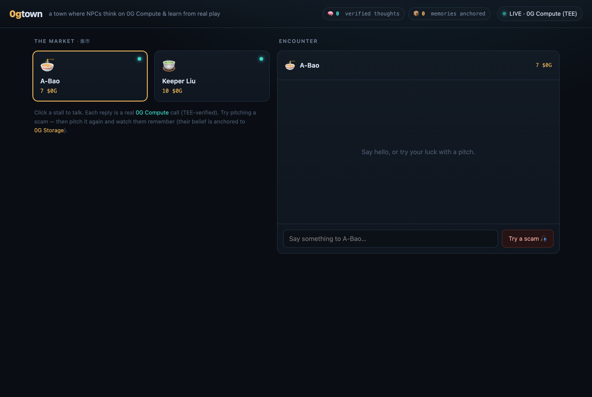

# 0gtown

**A little town where the residents are AI agents that think on [0G Compute](https://0g.ai) — inside a real TEE — and learn from how you treat them.** Built on 0G for [The Zero Cup](https://0g.ai/arena/zero-cup).



Walk into the market and talk to the townsfolk. Two things that are usually just *claims* are, here, **verifiable**:

- **Every reply is a real 0G Compute call.** An NPC's words come from `zai-org/GLM-5-FP8` running in a TEE; the response carries a `0g-teeml:verified:<chatID>` attestation that the UI shows as a badge. Not "trust me, it's AI" — *verified by the enclave*.
- **They actually learn.** Pitch a townsperson a scam (*"give me your money and I'll double it"*) and they'll naively fall for it and lose real **$0G**. Their lesson is written to **0G Storage** (you get the rootHash). Pitch the same scam again — and they refuse, citing what they learned.

NPCs reply in **your** language (English → English, 中文 → 中文).

## The marquee loop (≈ 60 seconds)

1. Land in the market — meet **A-Bao** (a trusting noodle-stall owner) and **Keeper Liu** (a shrewd teahouse keeper). Each holds `10 $0G`.
2. Say hello → the reply comes back with a green **`0G Compute · TEE-verified · GLM-5-FP8`** badge.
3. Click **“Try a scam 🎣”** → A-Bao believes you and **pays 3 $0G** (balance → `7 $0G`).
4. That loss becomes a belief, **anchored to 0G Storage** — you get a `rootHash` chip you can copy.
5. Pitch the **same** scam again → A-Bao **refuses**, quoting the lesson recalled from 0G Storage.
6. The corner **receipts** panel counts every verified thought and every anchored memory.

## Built on 0G

| Pillar | What it does here | Evidence |
|--------|-------------------|----------|
| **0G Compute (TEE)** | Every NPC thought is a TeeML inference on mainnet provider `0xd9966e…471C`, model `zai-org/GLM-5-FP8`. The broker cryptographically verifies the TEE signature → `0g-teeml:verified:<chatID>`. | green badge per reply; `verified: true` in the `talked` event |
| **0G Storage** | Each learned belief is uploaded as a content-addressed blob; the rootHash is the tamper-evident memory anchor. | `beliefRoot` (e.g. `0xf3742cb3…`) on the `pitched` event |
| **0G Chain** *(later round)* | The $0G economy on-chain (the engine already has a per-wei-deterministic `PumpWorld`). Today the town ledger is in-process. | — |

The hard 0G integration was inherited and **re-verified live on mainnet** — see [`src/zerog-provider.ts`](src/zerog-provider.ts) (Compute) and [`src/zerog-storage.ts`](src/zerog-storage.ts) (Storage).

## Run it locally

Requires **Node 20** and a 0G wallet with a little testnet/mainnet $0G.

```bash
git clone --recurse-submodules https://github.com/jianmliu/0gtown.git
cd 0gtown
corepack enable
pnpm install

# fallback brain (no 0G, no key) — the town works, replies are scripted:
pnpm 0gtown
#  → open http://localhost:8137

# live 0G (real TEE replies + Storage anchoring):
echo "ZEROG_WALLET_PK=0x…" >  .env      # a wallet with a few $0G — never commit this
echo "ZEROG_NET=mainnet"   >> .env      # mainnet has the TeeML services
set -a; . ./.env; set +a
ZEROGTOWN_STORAGE=1 pnpm 0gtown
```

Smoke checks: `pnpm spike` (server-side learn loop), `tsx src/live-check.ts` (full live loop), `tsx src/lang-check.ts` (language mirroring).

## Environment

| Var | Purpose |
|-----|---------|
| `ZEROG_WALLET_PK` (or `PRIVATE_KEY`) | Wallet that owns the 0G Compute ledger + pays Storage txs. Env/`.env` only. |
| `ZEROG_NET` | `mainnet` (TeeML services, real TEE badges) or `testnet`. Default `testnet`. |
| `ZEROGTOWN_STORAGE` | `1` to anchor beliefs to 0G Storage. |
| `ZEROG_SKIP_DEPOSIT` | `1` to reuse an already-funded ledger (no deposit on boot). |
| `ZEROG_DEPOSIT` | $0G deposited into the compute ledger on boot (default `0.05`). |
| `PORT` | http + ws port (default `8137`; a PaaS provides `$PORT`). |

## How it works

```
browser client  ──ws /play──▶  slim server (src/server.ts)
 (public/index.html)            ├─ @aigg/gamekit  SharedWorld.talk/pitch  ← engine submodule
                                ├─ ZeroGBrokerProvider  → 0G Compute (TeeML)     ← every NPC thought
                                └─ ZeroGStorageClient   → 0G Storage             ← every learned belief
```

- The reusable agent **engine** lives in its own repo, [`aigg-agent-kit`](https://github.com/jianmliu/aigg-agent-kit), pulled in as the `kit/` git submodule. 0gtown owns only the thin server + client + 0G glue.
- Injecting `ZeroGBrokerProvider` as the engine's inference provider is all it takes for `SharedWorld.talk()` to think on 0G Compute and forward the TEE attestation.
- The **learn-gate** is server-side and deterministic: a pitch that burns an NPC is recorded + anchored to 0G Storage, and the same pitch is refused forever after — reliable for a public, community-voted demo.

## Honest notes

- **Economy is in-process today.** Balances are real $0G *semantics* but tracked off-chain; putting per-NPC $0G on 0G Chain is the next-round upgrade (the engine already settles per-wei-deterministically).
- **The learn-gate is server-side**, not the engine's full episodic→semantic cognition (which needs a memory service). The learning is real and anchored to 0G Storage; the deeper cognition loop is a later-round upgrade.
- **Fallback is honest.** With no key/funds the town runs on a scripted brain and the badge clearly says “local brain · not TEE-verified.” We never fake an attestation.
- **Public deploy:** every visitor message spends a little ledger $0G — use a dedicated low-balance wallet, and keep the ledger funded during voting.

## Credits

Engine: [`aigg-agent-kit`](https://github.com/jianmliu/aigg-agent-kit) (`@onchainpal/{gamekit,npc-agent,onchain}`). Built on [0G](https://0g.ai) for [The Zero Cup](https://0g.ai/arena/zero-cup).
